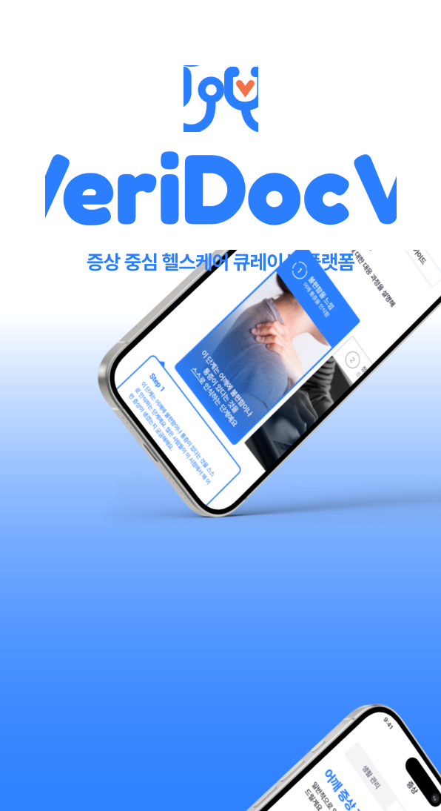
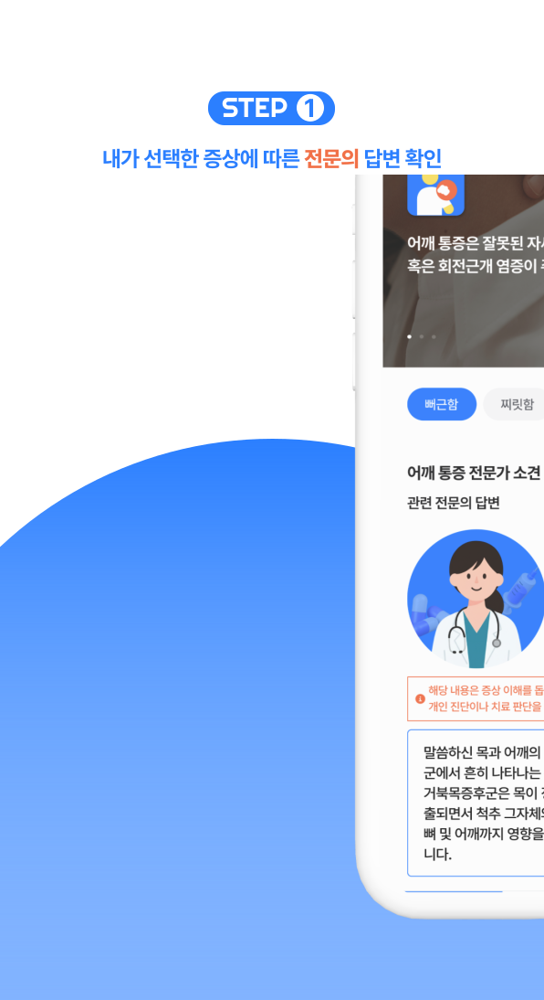
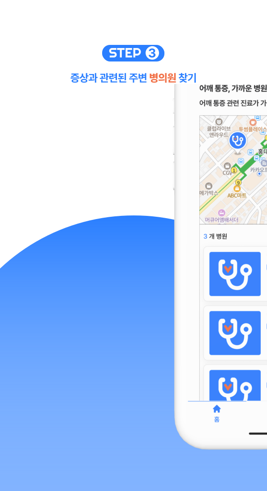
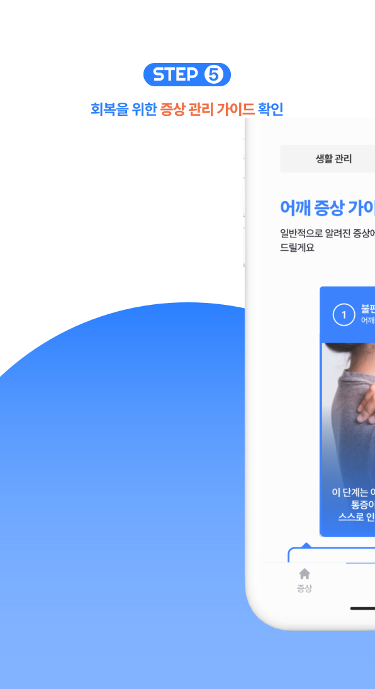
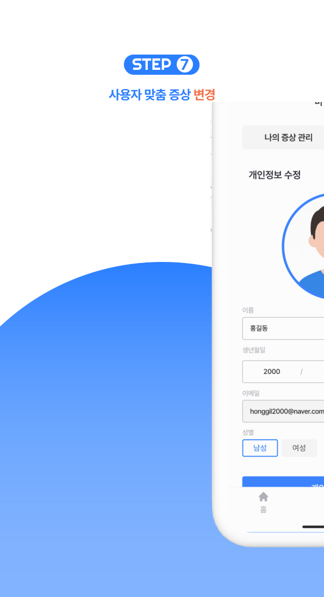
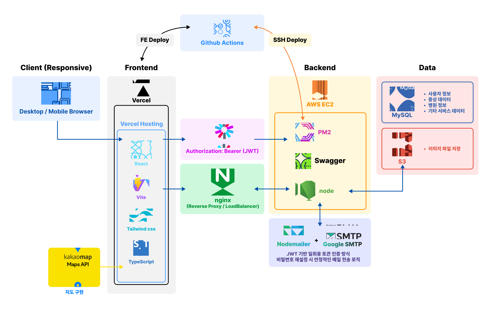

### VeriDoc - 사용자 맞춤형 의료 정보 큐레이션 서비스

  

 

  <a href="https://veridoc-umber.vercel.app/">홈페이지</a>
  |  
  <a href="https://distinct-manchego-e2f.notion.site/VeriDoc-2d91c66fccee8038bc97f39cfde05dfd?source=copy_link">Notion</a>
  |
  <a href="http://13.125.170.209/api-docs">Swagger</a>

---

## ✍️ 프로젝트 개요

- **프로젝트명:** VeriDoc (베리닥)
- **프로젝트 기간:** 2025.12.22 ~ 2026.02.19
- **프로젝트 형태:** UMC 9th 프로젝트
- **목표:** 정보 과잉 시대에 사용자가 자신의 증상을 쉽고 정확하게 기록하고, 검증된 전문의 콘텐츠를 통해 신뢰도 높은 의료 탐색을 할 수 있도록 돕는 서비스 개발
- **주요 타겟 사용자:** 정확한 건강 정보와 빠른 자가 대처법을 찾는 모든 사용자

---

## ✍️ 프로젝트 소개

### 프로젝트 배경

기존의 의료 정보 검색 프로세스는 다음과 같은 문제점이 있었습니다:

1. **정보의 과부하 및 부정확성**: 검색 결과가 너무 많거나, 광고성 정보로 인해 신뢰할 수 있는 정보를 찾기 어려움
2. **증상 기록의 파편화**: 자신의 증상을 구체적으로 기록하고 관리할 수 있는 직관적인 도구의 부재
3. **초기 대응의 막막함**: 병원 방문 전, 신뢰할 수 있는 임시 대처법(스트레칭, 찜질 등)을 찾기 힘듦

**VeriDoc**은 위 문제를 해결하기 위해 증상 라벨링 시스템과 검증된 전문의 답변 큐레이션, 그리고 위치 기반 병원 추천을 결합하여 사용자에게 최적화된 의료 여정을 선사합니다.

---

## 🚀 프로젝트 목표

1. **의료 정보의 신뢰성 확보**: 검증된 기관 및 전문의의 데이터만 노출하여 사용자 신뢰도 구축
2. **직관적인 사용자 경험(UX)**: 웹과 모바일 어디서든 매끄러운 반응형 환경과 쉬운 증상 입력 제공
3. **탐색 효율성 극대화**: 사용자의 위치와 증상에 기반한 병원 추천으로 진료 장벽 완화

---

## 📌 주요 기능

### **1. 증상 라벨링 기반 입력**
- 대표 증상과 세부 증상을 태그 형태로 선택하여 현재 상태를 정확하고 간편하게 기록합니다.

### **2. 검증된 전문의 답변 & 임시 대처**
- 증상별로 출처가 명확한 전문의 답변 1건과 즉각적인 도움이 되는 스트레칭/응급 처치 정보를 제공합니다.

### **3. 위치 기반 병원 추천**
- 선택한 증상과 연관된 진료과 병원 중, 사용자 위치에서 가장 가까운 TOP 3 정보를 추천합니다.

<table>
  <tr>
    <td></td>
    <td></td>
    <td></td>
    <td></td>
  </tr>
  <tr>
    <td></td>
    <td></td>
    <td></td>
    <td></td>
  </tr>
</table>

---

## ⚙️ 기술 스택

<table>
  <thead>
    <tr>
      <th>분류</th>
      <th>기술 스택</th>
    </tr>
  </thead>
  <tbody>
    <tr>
      <td>Frontend</td>
      <td>
        
        
        
        
        
      </td>
    </tr>
    <tr>
      <td>Backend</td>
      <td>
        
        
        
        
        
      </td>
    </tr>
    <tr>
      <td>Infrastructure</td>
      <td>
        
        
        
        
        
      </td>
    </tr>
    <tr>
      <td>Database</td>
      <td>
        
      </td>
    </tr>
    <tr>
      <td>DevOps</td>
      <td>
        
        
      </td>
    </tr>
    <tr>
      <td>External API</td>
      <td>
        
        
      </td>
    </tr>

  </tbody>
</table>

---

## 🛠️ 시스템 아키텍처

  

---

## 👥 팀원 소개

| 이름 | 역할 |
| --- | --- |
| [주니마니정/정준희](https://github.com/jjh-98) | -FF5A5F?style=for-the-badge) |
| 리버/임지윤 |  |
| [밍/김민지](https://github.com/min-minnn) |  |
| [블루/강민석](https://github.com/Mallandaine) |  |
| [여비/김준엽](https://github.com/junyeop22) |  |
| [윤/정윤주](https://github.com/dbswn0) |  |
| [토리/이윤재](https://github.com/Yoonjae0923) |  |
| [진이/차현진](https://github.com/Coconut-lab) |  |
| [다니/김다니엘](https://github.com/jagabi816) |  |
| [몬트/안상현](https://github.com/ashB1124) |  |
| [딤봉/최규찬](https://github.com/DimbongCHOI) |  |

